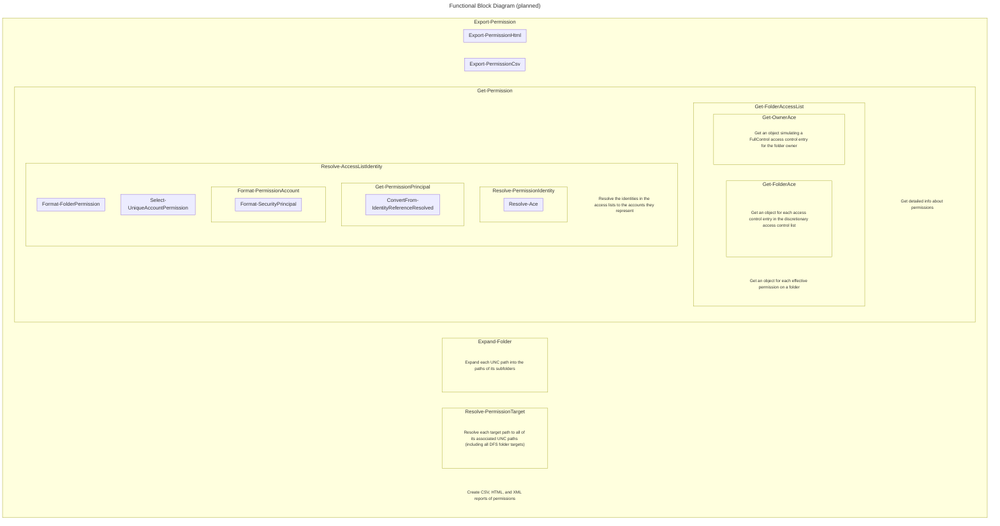

````
Export-Permission
  Get-Permission (foreach Folder)
    Get-FolderAccessList
      Get-FolderAce
    Resolve-AccessList (foreach AccessControlEntry)
      Resolve-PermissionIdentity
        Resolve-Ace
          Resolve-IdentityReference
      Get-PermissionPrincipal
        ConvertFrom-IdentityReferenceResolved
      Format-PermissionAccount
        Format-SecurityPrincipal
      Select-UniqueAccountPermission
      Format-FolderPermission

  Export-PermissionCsv
  Export-PermissionHtml
````


