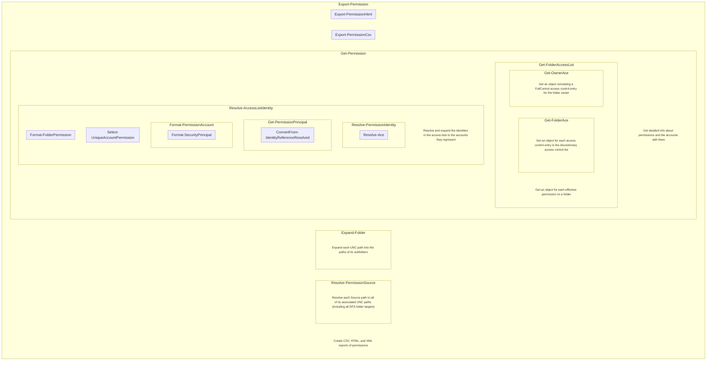

# v0 Original Design

This original design was discarded in favor of a flatter code structure.

## Markdown

### Export-Permission

- Get-Permission
  - (foreach LiteralPath)
    - Resolve-PermissionSource
    - (foreach ResolvedLiteralPath)
      - Expand-PermissionSource
      - (foreach ExpandedResolvedLiteralPath)
        - Get-FolderAcl
          - Get-DirectorySecurity
          - Get-OwnerAce
        - Resolve-AccessControlList
          - Resolve-Acl
            - (foreach AccessControlEntry)
              - Resolve-Ace
                - Resolve-IdentityReferenceDomainDNS
                - Get-AdsiServer
                - Resolve-IdentityReference
              - Get-PermissionPrincipal
                - ConvertFrom-IdentityReferenceResolved
                  - Get-DirectoryEntry -or
                  - Get-WinNTGroupMember -or
                  - Search-Directory
                  - (foreach GroupMember)
                    - Get-AdsiGroupMember -or
                    - Get-WinNTGroupMember
              - Format-PermissionAccount
                - Format-SecurityPrincipal
              - Select-UniqueAccountPermission
              - Format-FolderPermission
- Export-PermissionCsv
- Export-PermissionHtml

## MermaidJS Client-Side Rendering

