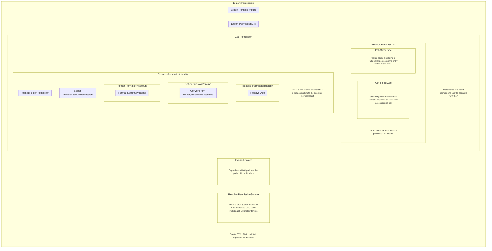

# Functional Block Diagram

This page contains functional block diagrams representing the script and the functions it calls

## As-Built

### Markdown

#### Export-Permission

- 1
  - 1.1 **New-DatedSubfolder** Create a 3-tier folder structure with a folder for the current year, month, and timestamp.
  - 1.2 **Initialize-PermissionCache** Create an in-process cache to reduce calls to other processes, disk, or network, and to store repetitive parameters for better readability of code and logs.
- 2
  - 2.1 **Write-LogMsg** Prepend a prefix to a log message, write the message to an output stream, and write the message to a text file.
  - 2.2 **ConvertTo-PermissionFqdn** Get the FQDN of the computer running the script.
  - 2.3 **Get-PermissionTrustedDomain** Discover any domains trusted by the domain of the computer running the script.
  - 2.4 **Resolve-PermissionSource** Resolve source paths to network paths such as UNC paths (including all DFS folder targets).
  - 2.5 **Expand-PermissionSource** Expand parent paths into the paths of their children.
  - 2.6 **Find-ServerFqdn** Get the FQDN of this computer, each trusted domain, and each server in the paths.
  - 2.7 **Get-AccessControlList** Get the ACL of each path.
  - 2.8 **Optimize-PermissionCache** Query each FQDN to pre-populate caches, avoiding redundant ADSI and CIM queries.
  - 2.9 **Resolve-AccessControlList** Resolve each identity reference (from the ACLs) to its SID and NTAccount name.
  - 2.10 **Get-CurrentDomain** Get the current domain.
  - 2.11 **Get-PermissionPrincipal** Use ADSI and CIM to get details about each resolved identity reference.
  - 2.12 **Expand-Permission** Join access rules with their associated accounts.
  - 2.13 **Select-PermissionPrincipal** Hide domain names and include/exclude accounts as specified in the report parameters.
  - 2.14 **Invoke-PermissionAnalyzer** Analyze the permissions aginst established best practices.
  - 2.15 **Format-Permission** Format the permissions.
  - 2.16 **Out-PermissionFile** Export the report files.
- 3
  - 3.1 **Send-PrtgXmlSensorOutput** Send the results to a PRTG Custom XML Push Sensor for monitoring.
- 4
  - 4.1 **Out-Permission** Output the results to the pipeline.
  - 4.2 **Remove-CachedCimSession** Cleanup CIM sessions.
- 5
  - 5.1 **Export-LogCsv** Export the buffered log messages to a CSV file.

### Draw.IO XML Rendered as SVG

## Original Design

This original design was discarded in favor of a flatter code structure.

### Markdown

#### Export-Permission

- Get-Permission
  - (foreach LiteralPath)
    - Resolve-PermissionSource
    - (foreach ResolvedLiteralPath)
      - Expand-PermissionSource
      - (foreach ExpandedResolvedLiteralPath)
        - Get-FolderAcl
          - Get-DirectorySecurity
          - Get-OwnerAce
        - Resolve-AccessControlList
          - Resolve-Acl
            - (foreach AccessControlEntry)
              - Resolve-Ace
                - Resolve-IdentityReferenceDomainDNS
                - Get-AdsiServer
                - Resolve-IdentityReference
              - Get-PermissionPrincipal
                - ConvertFrom-IdentityReferenceResolved
                  - Get-DirectoryEntry -or
                  - Get-WinNTGroupMember -or
                  - Search-Directory
                  - (foreach GroupMember)
                    - Get-AdsiGroupMember -or
                    - Get-WinNTGroupMember
              - Format-PermissionAccount
                - Format-SecurityPrincipal
              - Select-UniqueAccountPermission
              - Format-FolderPermission
- Export-PermissionCsv
- Export-PermissionHtml

### MermaidJS Client-Side Rendering

